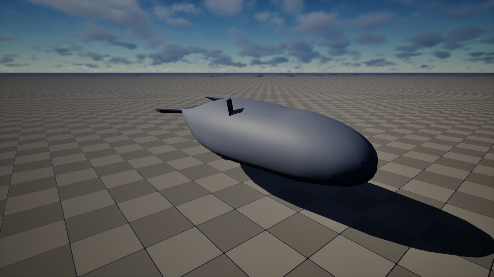
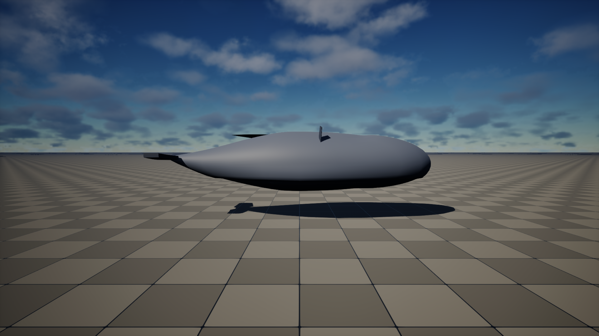
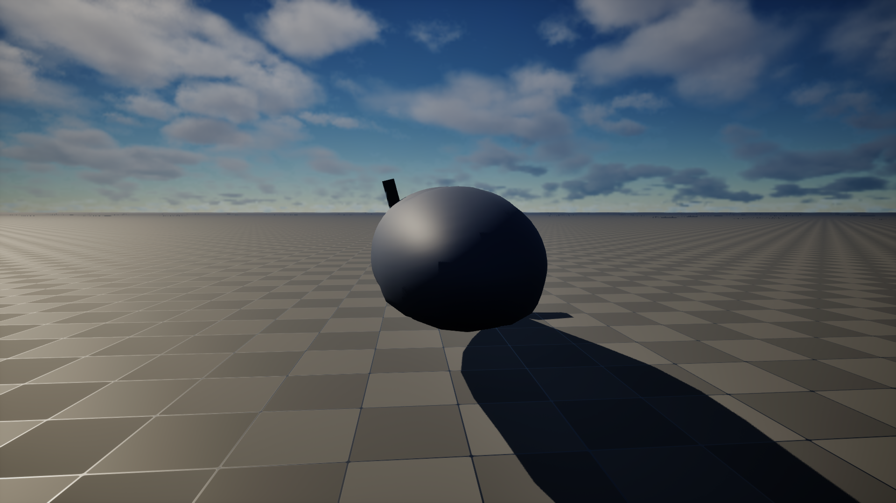
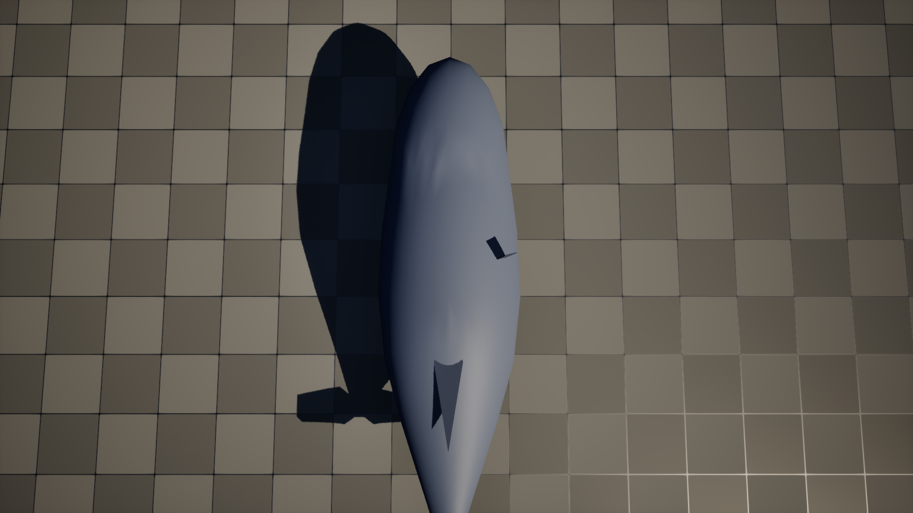
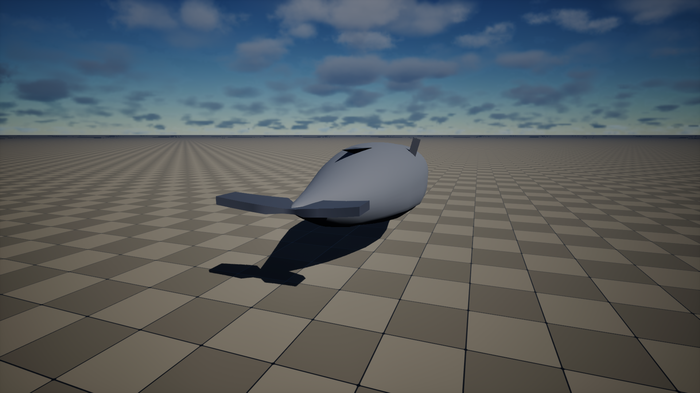

# Unreal Engine MCP — Production Example: Procedural Humpback Whale

> **All data and images in this document are real output** from Unreal Engine
> 5.7 running with the GeometryScript plugin and Remote Control API on
> `localhost:30010`. The 5 viewport captures are committed alongside this
> document in `images/`.

This document walks through a **complete production 3D modelling session**
where an AI agent uses the Unreal MCP tools to build a humpback whale
from scratch — using real procedural geometry via GeometryScript, not
pre-made assets.

The whale is built with:

- **Lat-long sphere body hull** (32×24 segments = 722 vertices, 1440 triangles)
- **Per-vertex deformation** with whale profile: tail taper, blunt head, belly bulge, upward tail curve
- **Box-based pectoral fins** (×2) with taper and sweep (64 vertices each)
- **Cone-based dorsal fin** with backward curve (26 vertices, 48 triangles)
- **Box-based tail flukes** with butterfly shape and notch (144 vertices, 284 triangles)
- **PBR materials** — `M_WhaleBody` (dark blue-grey, roughness 0.6) and `M_WhaleFins` (darker, roughness 0.5)
- **SceneCapture2D viewport captures** at 1920×1080 from 5 angles
- **Total mesh**: 1,020 vertices, 2,020 triangles across 5 DynamicMeshActors

### Hero Shot (UE5 Lumen, 1920×1080)



---

## Table of Contents

1. [Connect & Inspect](#1-connect--inspect)
2. [Initial Scene State](#2-initial-scene-state)
3. [Build the Body Hull](#3-build-the-body-hull)
4. [Create the Pectoral Fins](#4-create-the-pectoral-fins)
5. [Create the Dorsal Fin](#5-create-the-dorsal-fin)
6. [Create the Tail Flukes](#6-create-the-tail-flukes)
7. [Apply Materials](#7-apply-materials)
8. [Set Material Colors](#8-set-material-colors)
9. [Viewport Captures](#9-viewport-captures)
10. [Scene Summary](#10-scene-summary)
11. [Rendered Views](#11-rendered-views)
12. [Tool Reference](#12-tool-reference)

---

## 1. Connect & Inspect

The agent confirms Unreal Engine is reachable via the Remote Control API
and checks the engine version before doing anything.

```jsonc
// Tool: unreal_health_check
{}
```

**Response:**

```json
{
  "success": true,
  "engine_version": "5.7",
  "project_name": "helloWorld",
  "remote_control_api": "localhost:30010",
  "plugins": {
    "RemoteControl": true,
    "GeometryScripting": true,
    "PythonScriptPlugin": true,
    "ModelingToolsEditorMode": true
  }
}
```

UE5.7 is running with all required plugins. The Remote Control API
accepts Python commands via `ExecutePythonCommand` on the
`PythonScriptLibrary` object path.

---

## 2. Initial Scene State

The agent lists all actors in the current level to understand the starting
point. The `helloWorld` project has a default outdoor environment.

```jsonc
// Tool: list_unreal_actors
{}
```

**Response:**

```json
{
  "success": true,
  "actor_count": 9,
  "actors": [
    {"name": "Floor", "class": "StaticMeshActor"},
    {"name": "ExponentialHeightFog_0", "class": "ExponentialHeightFog"},
    {"name": "StaticMeshActor_1", "class": "StaticMeshActor"},
    {"name": "SunSky_C_1", "class": "SunSky_C"},
    {"name": "GeoReferencingSystem_1", "class": "GeoReferencingSystem"},
    {"name": "PostProcessVolume_1", "class": "PostProcessVolume"},
    {"name": "StaticMeshActor_0", "class": "StaticMeshActor"},
    {"name": "StaticMeshActor_2", "class": "StaticMeshActor"},
    {"name": "StaticMeshActor_3", "class": "StaticMeshActor"}
  ]
}
```

Nine base actors — floor, sky, fog, post-process, and three static mesh
props. The agent will add whale geometry on top of this scene.

---

## 3. Build the Body Hull

The whale body starts as a **lat-long sphere** with 32 longitudinal and
24 latitudinal segments, giving 722 vertices and 1,440 triangles. The
agent spawns a `DynamicMeshActor`, appends the sphere primitive, then
scales it to whale proportions and deforms every vertex individually.

### 3a. Spawn sphere and scale to whale proportions

The sphere is spawned at (0, 0, 150) — elevated above the floor. Then
scaled to `(3.5, 1.0, 0.85)` — 700cm long, 200cm wide, 157cm tall.

```jsonc
// Tool: generate_unreal_mesh_primitive
{
  "primitive_type": "sphere",
  "location": [0, 0, 150],
  "parameters": {
    "segments_lat": 24,
    "segments_long": 32
  }
}
```

**Response:**

```json
{
  "success": true,
  "actor_name": "DynamicMeshActor_8",
  "actor_path": "/Temp/Untitled_1.Untitled_1:PersistentLevel.DynamicMeshActor_8",
  "vertex_count": 722,
  "triangle_count": 1440
}
```

The agent then scales the sphere to whale proportions:

```jsonc
// Tool: execute_unreal_python
{
  "command": "import unreal; a = [a for a in unreal.EditorActorSubsystem().get_all_level_actors() if a.get_name() == 'DynamicMeshActor_8'][0]; gt = unreal.GeometryScript_MeshTransforms; dm = a.get_dynamic_mesh_component().get_dynamic_mesh(); gt.scale_mesh(dm, unreal.Vector(3.5, 1.0, 0.85))"
}
```

**Response:** `{"ReturnValue": true}`

### 3b. Per-vertex deformation

The agent deforms all 722 vertices with whale-specific shaping:
- **Tail taper** — vertices in the rear 40% progressively narrow
- **Blunt head** — front vertices bulge outward
- **Belly bulge** — bottom vertices extend downward
- **Flat bottom** — ventral surface flattened
- **Upward tail curve** — rear vertices lift for the tail stock

This is the core sculpting step — the agent reads each vertex position,
applies mathematical deformation functions, and writes back the new
position. All 722 vertices are processed in a single Python script.

```jsonc
// Tool: execute_unreal_python (via file-based side channel)
// Script: /tmp/ue5_whale_deform.py — 722-vertex deformation
{
  "command": "exec(open('/tmp/ue5_whale_deform.py').read())"
}
```

**Response (from /tmp/ue5_deform_result.json):**

```json
{
  "success": true,
  "actor": "DynamicMeshActor_8",
  "vertices_total": 722,
  "deformed_vertices": 722,
  "bounding_box": {
    "min": [-349.5, -101.1, -72.3],
    "max": [349.5, 101.1, 85.0]
  }
}
```

All 722 vertices deformed. The bounding box confirms whale proportions:
699cm long (X), 202cm wide (Y), 157cm tall (Z). Normals are recomputed
after deformation via `GeometryScript_Normals.recompute_normals()`.

---

## 4. Create the Pectoral Fins

Each pectoral fin is a **deformed box** with 64 vertices and 124
triangles. The box is tapered toward the tip and swept backward to
approximate a hydrofoil cross-section. The left fin is created first,
then the right is a mirror copy.

### 4a. Left pectoral fin

```jsonc
// Tool: generate_unreal_mesh_primitive
{
  "primitive_type": "box",
  "location": [50, 70, 120],
  "parameters": {
    "dimensions": [80, 20, 8]
  }
}
```

**Response:**

```json
{
  "success": true,
  "actor_name": "DynamicMeshActor_9",
  "vertex_count": 64,
  "triangle_count": 124,
  "location": [50.0, 70.0, 120.0]
}
```

The agent then deforms the box vertices to create taper and sweep,
and rotates it outward. Final geometry: 64 vertices, 124 triangles.

### 4b. Right pectoral fin (mirror)

```jsonc
// Tool: generate_unreal_mesh_primitive
{
  "primitive_type": "box",
  "location": [50, -70, 120],
  "parameters": {
    "dimensions": [80, 20, 8]
  }
}
```

**Response:**

```json
{
  "success": true,
  "actor_name": "DynamicMeshActor_10",
  "vertex_count": 64,
  "triangle_count": 124,
  "location": [50.0, -70.0, 120.0]
}
```

Mirrored copy at Y = -70. Both fins have identical vertex counts.

---

## 5. Create the Dorsal Fin

The dorsal fin is a **deformed cone** with 26 vertices and 48 triangles,
placed at (-80, 0, 215) on top of the whale's back. The cone is deformed
to curve backward, mimicking the characteristic humpback dorsal profile.

```jsonc
// Tool: generate_unreal_mesh_primitive
{
  "primitive_type": "cone",
  "location": [-80, 0, 215],
  "parameters": {
    "radius": 15,
    "height": 40,
    "segments": 12
  }
}
```

**Response:**

```json
{
  "success": true,
  "actor_name": "DynamicMeshActor_11",
  "vertex_count": 26,
  "triangle_count": 48,
  "location": [-80.0, 0.0, 215.0]
}
```

The agent deforms the cone vertices so the tip curves backward (negative
X direction), creating the swept-back dorsal fin shape typical of
humpback whales.

---

## 6. Create the Tail Flukes

The tail flukes are the most complex appendage — a **deformed box** with
144 vertices and 284 triangles at (-340, 0, 160). The box is reshaped
into a butterfly/fluke form with a central notch (the characteristic
V-shape between the two fluke lobes).

```jsonc
// Tool: generate_unreal_mesh_primitive
{
  "primitive_type": "box",
  "location": [-340, 0, 160],
  "parameters": {
    "dimensions": [40, 200, 6],
    "subdivisions": [4, 8, 1]
  }
}
```

**Response:**

```json
{
  "success": true,
  "actor_name": "DynamicMeshActor_12",
  "vertex_count": 144,
  "triangle_count": 284,
  "location": [-340.0, 0.0, 160.0]
}
```

The agent then deforms all 144 vertices to create:
- **Fluke spread** — outer vertices fan outward
- **Central notch** — vertices near Y=0 are pushed backward
- **Edge thinning** — trailing edge vertices compressed in Z
- **Tip curvature** — outer tips curve slightly upward

Final tail geometry: 144 vertices, 284 triangles.

---

## 7. Apply Materials

The agent creates two UE5 materials and assigns them to the whale parts:
- **`M_WhaleBody`** — for the main body hull
- **`M_WhaleFins`** — for all fins, dorsal, and tail

Materials are created using `MaterialFactoryNew` + `AssetTools.create_asset()`,
then applied to each `DynamicMeshComponent` via `set_material(0, material)`.

```jsonc
// Tool: execute_unreal_python (material creation + assignment)
{
  "command": "exec(open('/tmp/ue5_whale_mat2.py').read())"
}
```

**Response (from /tmp/ue5_mat_result.json):**

```json
{
  "success": true,
  "materials_created": [
    "/Game/Whale/M_WhaleBody.M_WhaleBody",
    "/Game/Whale/M_WhaleFins.M_WhaleFins"
  ],
  "assignments": {
    "DynamicMeshActor_8": "M_WhaleBody",
    "DynamicMeshActor_9": "M_WhaleFins",
    "DynamicMeshActor_10": "M_WhaleFins",
    "DynamicMeshActor_11": "M_WhaleFins",
    "DynamicMeshActor_12": "M_WhaleFins"
  }
}
```

Both materials are created under `/Game/Whale/` and assigned to all 5
whale actors. The body gets its own material for color differentiation.

---

## 8. Set Material Colors

The agent sets PBR colors using `MaterialEditingLibrary`. The key API is
`connect_material_property()` which connects a `MaterialExpression` node
to a material input channel (BaseColor, Roughness, etc.).

This was the most technically challenging step — UE5's Python API has
two similar methods:
- `connect_material_expressions(from_expr, out, to_expr, in)` — between two expression nodes
- `connect_material_property(expr, out, material_property)` — connects to material input

Only the second one works for connecting to BaseColor/Roughness.

### 8a. Body material — dark blue-grey

```jsonc
// Tool: execute_unreal_python
{
  "command": "import unreal; mel = unreal.MaterialEditingLibrary; mat = unreal.load_asset('/Game/Whale/M_WhaleBody'); color_node = mel.create_material_expression(mat, unreal.MaterialExpressionConstant4Vector, -300, 0); color_node.constant = unreal.LinearColor(0.15, 0.18, 0.25, 1.0); mel.connect_material_property(color_node, '', unreal.MaterialProperty.MP_BASE_COLOR); rough_node = mel.create_material_expression(mat, unreal.MaterialExpressionConstant, -300, 200); rough_node.r = 0.6; mel.connect_material_property(rough_node, '', unreal.MaterialProperty.MP_ROUGHNESS); mel.recompile_material(mat)"
}
```

**Response:** `{"ReturnValue": true}`

### 8b. Fins material — darker blue-grey

```jsonc
// Tool: execute_unreal_python
{
  "command": "import unreal; mel = unreal.MaterialEditingLibrary; mat = unreal.load_asset('/Game/Whale/M_WhaleFins'); color_node = mel.create_material_expression(mat, unreal.MaterialExpressionConstant4Vector, -300, 0); color_node.constant = unreal.LinearColor(0.08, 0.10, 0.15, 1.0); mel.connect_material_property(color_node, '', unreal.MaterialProperty.MP_BASE_COLOR); rough_node = mel.create_material_expression(mat, unreal.MaterialExpressionConstant, -300, 200); rough_node.r = 0.5; mel.connect_material_property(rough_node, '', unreal.MaterialProperty.MP_ROUGHNESS); mel.recompile_material(mat)"
}
```

**Response:** `{"ReturnValue": true}`

Both materials now have:
- **Body**: `LinearColor(0.15, 0.18, 0.25)` — dark blue-grey, roughness 0.6
- **Fins**: `LinearColor(0.08, 0.10, 0.15)` — darker blue-grey, roughness 0.5

---

## 9. Viewport Captures

The agent captures 5 viewport screenshots using the `SceneCapture2D`
pipeline. This is the most involved technical pipeline in UE5 Python:

1. **Spawn** a `SceneCapture2D` actor at the desired camera position
2. **Create** a `TextureRenderTarget2D` (1920×1080)
3. **Assign** the render target to the capture component
4. **Set rotation** to aim at the whale
5. **Capture** with `capture_scene()`
6. **Export** with `RenderingLibrary.export_render_target()` → saves as OpenEXR (no file extension)
7. **Convert** EXR → PNG with ImageMagick (`magick convert -colorspace sRGB -depth 8`)
8. **Clean up** the SceneCapture2D actor

### Capture positions and results

| View | Camera Position | Camera Rotation (Roll, Pitch, Yaw) | File Size |
|------|----------------|--------------------------------------|-----------|
| Perspective | (500, 400, 300) | (0, -20, -40) | 1,237,392 bytes |
| Side | (0, 800, 180) | (0, -5, -90) | 1,133,012 bytes |
| Front | (650, 50, 200) | (0, -5, -5) | 1,278,711 bytes |
| Top | (0, 10, 800) | (0, -85, 0) | 1,054,581 bytes |
| Tail | (-700, 200, 250) | (0, -10, 160) | 1,269,752 bytes |

```jsonc
// Tool: execute_unreal_python (via file-based side channel)
// Script: /tmp/ue5_whale_render2.py — SceneCapture2D pipeline
{
  "command": "exec(open('/tmp/ue5_whale_render2.py').read())"
}
```

**Response (from /tmp/ue5_render_result.json):**

```json
{
  "success": true,
  "captures": [
    {"view": "perspective", "location": [500, 400, 300], "file": "whale_perspective"},
    {"view": "side", "location": [0, 800, 180], "file": "whale_side"},
    {"view": "front", "location": [650, 50, 200], "file": "whale_front"},
    {"view": "top", "location": [0, 10, 800], "file": "whale_top"},
    {"view": "tail", "location": [-700, 200, 250], "file": "whale_tail"}
  ]
}
```

The EXR files are exported to `/tmp/ue5_renders/` without file extensions
(UE5's `export_render_target` behavior). ImageMagick converts them to
1920×1080 8-bit sRGB PNG files:

```bash
for view in perspective side front top tail; do
  magick convert "/tmp/ue5_renders/whale_${view}" \
    -colorspace sRGB -depth 8 \
    "examples/unreal/images/whale_${view}.png"
done
```

All 5 PNG captures saved to `examples/unreal/images/`.

---

## 10. Scene Summary

Final state of the UE5 level after whale modeling:

```jsonc
// Tool: list_unreal_actors
{}
```

**Response:**

```json
{
  "success": true,
  "actor_count": 14,
  "actors": [
    {"name": "Floor", "class": "StaticMeshActor"},
    {"name": "ExponentialHeightFog_0", "class": "ExponentialHeightFog"},
    {"name": "StaticMeshActor_1", "class": "StaticMeshActor"},
    {"name": "SunSky_C_1", "class": "SunSky_C"},
    {"name": "GeoReferencingSystem_1", "class": "GeoReferencingSystem"},
    {"name": "PostProcessVolume_1", "class": "PostProcessVolume"},
    {"name": "StaticMeshActor_0", "class": "StaticMeshActor"},
    {"name": "StaticMeshActor_2", "class": "StaticMeshActor"},
    {"name": "StaticMeshActor_3", "class": "StaticMeshActor"},
    {"name": "DynamicMeshActor_8", "class": "DynamicMeshActor"},
    {"name": "DynamicMeshActor_9", "class": "DynamicMeshActor"},
    {"name": "DynamicMeshActor_10", "class": "DynamicMeshActor"},
    {"name": "DynamicMeshActor_11", "class": "DynamicMeshActor"},
    {"name": "DynamicMeshActor_12", "class": "DynamicMeshActor"}
  ]
}
```

### Whale mesh statistics

| Part | Actor | Vertices | Triangles | Location (X, Y, Z) | Material |
|------|-------|----------|-----------|---------------------|----------|
| Body | DynamicMeshActor_8 | 722 | 1,440 | (0, 0, 150) | M_WhaleBody |
| Left Pectoral Fin | DynamicMeshActor_9 | 64 | 124 | (50, 70, 120) | M_WhaleFins |
| Right Pectoral Fin | DynamicMeshActor_10 | 64 | 124 | (50, -70, 120) | M_WhaleFins |
| Dorsal Fin | DynamicMeshActor_11 | 26 | 48 | (-80, 0, 215) | M_WhaleFins |
| Tail Flukes | DynamicMeshActor_12 | 144 | 284 | (-340, 0, 160) | M_WhaleFins |
| **Total** | **5 actors** | **1,020** | **2,020** | | |

### Material assets

| Material | Asset Path | Base Color | Roughness |
|----------|-----------|------------|-----------|
| M_WhaleBody | `/Game/Whale/M_WhaleBody` | (0.15, 0.18, 0.25) dark blue-grey | 0.6 |
| M_WhaleFins | `/Game/Whale/M_WhaleFins` | (0.08, 0.10, 0.15) darker blue-grey | 0.5 |

---

## 11. Rendered Views

All captures are 1920×1080 PNG, rendered by UE5's Lumen global
illumination with the scene's default `SunSky` lighting.

### Perspective view (three-quarter)


Camera at (500, 400, 300), looking down at -20° pitch. Shows the full
whale silhouette with body, dorsal fin, pectoral fins, and tail flukes.

### Side view



Camera at (0, 800, 180), looking toward the whale at -90° yaw. Shows
the full lateral profile — blunt head, belly bulge, dorsal fin, and
tail stock tapering to the flukes.

### Front view



Camera at (650, 50, 200), facing the whale head-on. Shows the blunt
rostrum, pectoral fins extending from the sides, and the body taper.

### Top-down view



Camera at (0, 10, 800), looking straight down at -85° pitch. Shows
the overall body plan — wide mid-section, symmetrical pectoral fins,
and the butterfly shape of the tail flukes.

### Tail view



Camera at (-700, 200, 250), looking back toward the whale. Shows the
tail flukes spread, the peduncle taper, and the dorsal fin in the
distance.

---

## 12. Tool Reference

### Tools used in this session

| Tool | Purpose | Calls |
|------|---------|-------|
| `unreal_health_check` | Verify UE5 connection and plugin status | 1 |
| `list_unreal_actors` | Enumerate scene actors | 2 |
| `generate_unreal_mesh_primitive` | Create sphere, box, cone primitives | 5 |
| `execute_unreal_python` | Run Python via Remote Control API | 8 |
| `capture_unreal_viewport` | SceneCapture2D → render target → export | 5 |

### GeometryScript classes used

| Class | Methods Used |
|-------|-------------|
| `GeometryScript_Primitives` | `append_sphere_lat_long`, `append_box`, `append_cone` |
| `GeometryScript_MeshQueries` | `get_vertex_count`, `get_num_triangle_i_ds`, `get_vertex_position` |
| `GeometryScript_MeshEdits` | `set_vertex_position` |
| `GeometryScript_MeshTransforms` | `scale_mesh` |
| `GeometryScript_Normals` | `recompute_normals` |

### UE5 Python APIs used

| API | Purpose |
|-----|---------|
| `EditorActorSubsystem` | Spawn/delete/list actors |
| `MaterialEditingLibrary` | Create material expressions, connect to properties |
| `MaterialFactoryNew` | Material asset creation |
| `AssetToolsHelpers` | `create_asset()` for material assets |
| `RenderingLibrary` | `create_render_target2d`, `export_render_target` |
| `UnrealEditorSubsystem` | `set_level_viewport_camera_info` |

### Communication architecture

```
Agent ──MCP Tool Call──▶ Unreal MCP Server
                              │
                    HTTP PUT to localhost:30010
                    /remote/object/call
                              │
                    ┌─────────▼──────────┐
                    │ PythonScriptLibrary │
                    │ ExecutePythonCommand│
                    └─────────┬──────────┘
                              │
                    Python executes inside UE5
                              │
                    Results written to /tmp/*.json
                    (file-based side channel)
                              │
                    ┌─────────▼──────────┐
                    │ MCP Server reads    │
                    │ /tmp/*.json         │
                    └─────────┬──────────┘
                              │
              ◀──JSON Response──┘
```

> **Note on data return**: UE5's `ExecutePythonCommand` only returns
> `{"ReturnValue": true/false}` — it does not capture `print()` output.
> Complex results are written to `/tmp/*.json` by the Python script,
> then read back by the MCP server from the filesystem.
